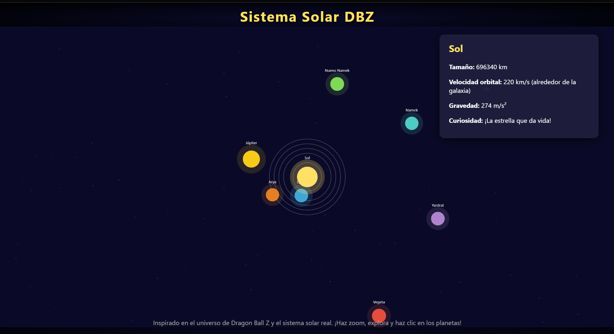

# Sistema Solar Dragon Ball

Este proyecto es una simulación interactiva del sistema solar inspirada en el universo de Dragon Ball Z. Puedes explorar planetas tanto reales como ficticios del anime, hacer zoom, arrastrar el sistema y descubrir curiosidades de cada planeta. Además, incluye efectos visuales y sonido característico de Dragon Ball.

## ¿Cómo funciona?
- Haz **zoom** con la rueda del ratón.
- **Arrastra** el sistema solar manteniendo presionado el botón izquierdo del ratón.
- Haz **clic** o pasa el mouse sobre los planetas para ver información y curiosidades.
- Disfruta de la música de Dragon Ball al interactuar.

## Estructura del proyecto
- `index.html`: Página principal.
- `sistema_solar.js`: Lógica de la simulación y animación.
- `style.css`: Estilos visuales.
- `img/`: Carpeta donde debes colocar las imágenes de los planetas y la nave.
- `sonido/`: Carpeta con el archivo de sonido de Dragon Ball.

## Cómo agregar imágenes
1. Coloca tus imágenes (por ejemplo: `tierra.png`, `jupiter.png`, `nave.png`, etc.) dentro de la carpeta `img/`.
2. Asegúrate de que los nombres de los archivos coincidan con los usados en el código JavaScript (`sistema_solar.js`).
3. Puedes usar imágenes libres de internet o crear tus propios íconos.

**Sistema solar de Dragon Ball del proyecto:**

```markdown

```

## Créditos
- Inspirado en el universo de Akira Toriyama.
- Sonido: DragonBall.mp3

¡Explora y diviértete aprendiendo sobre el sistema solar y Dragon Ball!
